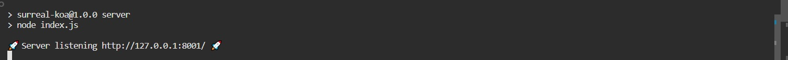
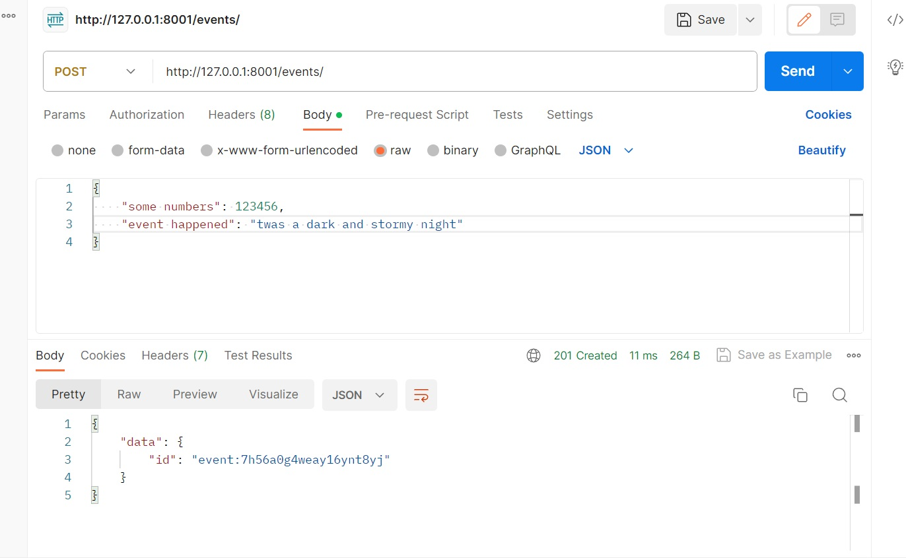
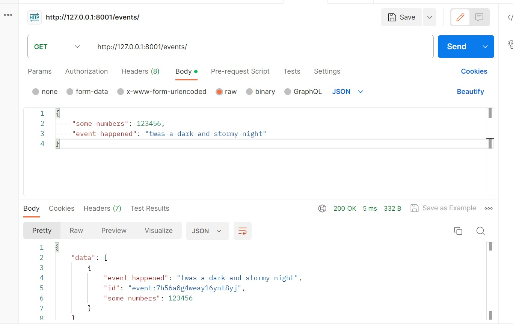
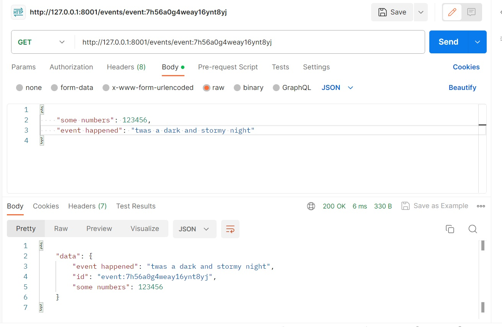
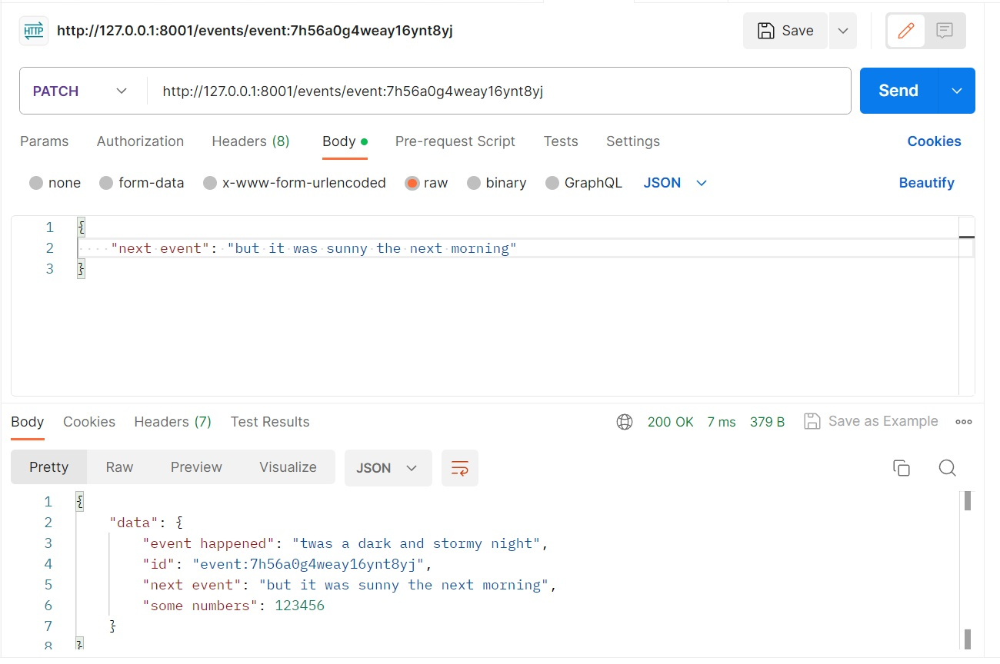
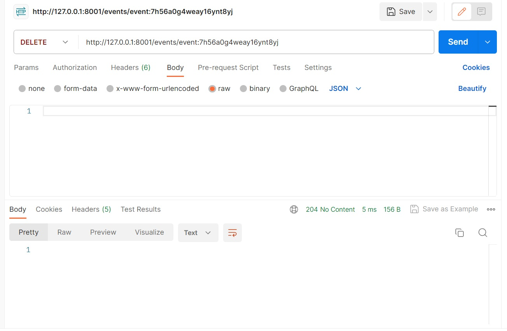

A starter-kit project from which to create your koa + SurrealDB projects

# SurrealDB + koa Demo

This project is a simple rest API built with [koa.js](https://koajs.com/) and SurrealDB

This starter kit comes with the following endpoints:

-   GET '/events' - lists all events
-   POST '/events' - create new event
-   GET '/events/:id' - get specific event by id
-   PATCH '/events/:id' - update a specific event by id
-   DELETE '/events/:id' - delete specific event by id

The database setup for this starter kit is schema-less and accepts any form of data.

### Getting started

-   Ensure you have SurrealDB installed and running.
-   This starterkit was built around using an in-memory store.
    -- Start surreal with: `surreal start memory -A --auth --user root --pass root`
-   Alternatively you can use a persistent storage with:
    -- `surreal start --log trace --user root --pass root --bind 0.0.0.0:8080 file://path/to/mydatabase`

More info here: [On Disk: SurrealDB Docs](https://surrealdb.com/docs/installation/running/file)

After the database is up and running:

-   Clone this repo: `git clone git@github.com:jerempy/surrealdb-starter-koa.git`
-   Ensure you have node: `node --version`
-   Install dependencies: `npm install`
-   Run the server: `npm run server`



The default host and port is `http://127.0.0.1:8001`

### Examples

Using postman or something similar:

#### `POST http://127.0.0.1:8001/events/`



#### `GET http://127.0.0.1:8001/events/`



#### `GET http://127.0.0.1:8001/events/event:7h56a0g4weay16ynt8yj`



#### `PATCH http://127.0.0.1:8001/events/event:7h56a0g4weay16ynt8yj`



#### `DELETE http://127.0.0.1:8001/events/event:7h56a0g4weay16ynt8yj`



### Configs

The following environment variables are looked for (with their defaults):

```javascript
SERVER_HOST || 'http://127.0.0.1';
SERVER_PORT || 8001;
SURREAL_HOST || 'http://127.0.0.1';
SURREAL_PORT || 8000;
SURREAL_USER || 'root';
SURREAL_PASSWORD || 'root';
SURREAL_NAMESPACE || 'starter';
SURREAL_DATABASE || 'events';
```

### Extending / Next steps

Some recommendations for next steps and extending are:

-   Set up middleware for things such as authentication and authorization.
-   Use SurrealDB as a peristent data store.
-   As more models get added these can be moved into their own models folder

### Contributing

If you find any issues or have suggestions for improvements, please feel free to open an issue or create a pull request.
